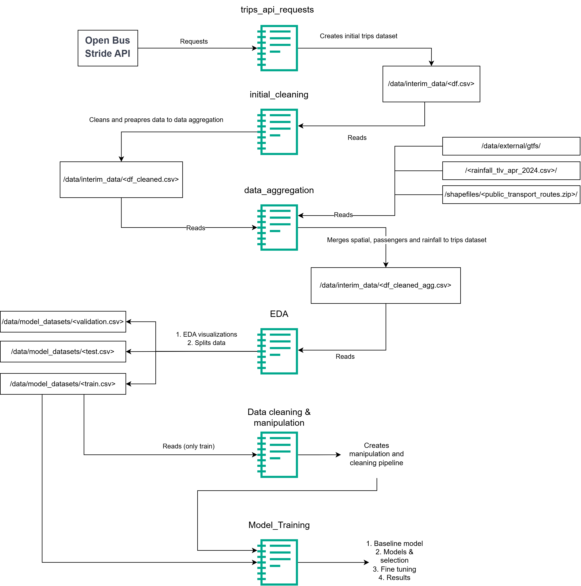

# Public Transport ML – Bus Delay Classification

Machine Learning project for analyzing and predicting public transportation operational performance using real-world bus trip data.

This project was developed as part of the **Bar-Ilan University Data Science course**, with the objective of learning and applying end-to-end machine learning workflows.

The project combines operational, spatial, passenger, and weather datasets in order to classify bus rides into:

- `early`
- `on_time`
- `delay`

The workflow includes:
- data extraction from SIRI APIs,
- GTFS-based spatial analysis,
- feature engineering,
- preprocessing pipelines,
- classification modeling,
- and operational performance evaluation.

---

## Project Objective

The goal of the project is to investigate the factors affecting public transportation schedule reliability and develop a machine learning model capable of predicting trip operational status.

The analysis focuses on trip-level operational behavior rather than segment-level prediction.

---

## Workflow



---

## Data Sources

The project integrates multiple transportation-related datasets:

- **SIRI API** – real-time operational ride data
- **GTFS** – planned schedules and route geometries
- **Passenger Activity Data** – passenger demand indicators
- **IMS Weather Data** – rainfall measurements
- **Public Transportation Priority Paths** – GIS spatial infrastructure layers

---

## Main Features

### Temporal Features
- Peak hour indicators
- Night operation indicators
- Departure and arrival hour extraction

### Spatial Features
- Route length
- Route curvity
- Public transportation priority-path overlap
- Urban route indicators

### Operational Features
- Passenger demand indicators
- Number of stops
- Speed and duration metrics

### Probability-Based Features
Historical probability of early trips by:
- operational hour
- route-length category

---

## Machine Learning Pipeline

The preprocessing pipeline includes:

- Missing value handling
- Outlier handling
- Feature engineering
- Probability-based feature generation
- Target encoding
- Feature selection
- Leakage prevention between train/validation/test datasets

Main preprocessing functions are located in:

```text
/src/data_cleaning_and_manipulations.py
```

---

## Models Tested

- Logistic Regression
- Random Forest
- LightGBM
- XGBoost

The final selected model was:

## ✅ XGBoost Classifier

Additional improvements included:
- SMOTE balancing
- Early-class threshold tuning
- Hyperparameter optimization using Optuna

---

## Final Results

Final test performance:

| Metric | Result |
|---|---|
| Accuracy | ~0.83 |
| F1 – Delay | ~0.90 |
| F1 – On Time | ~0.67 |
| F1 – Early | ~0.50 |

Main challenge:
- distinguishing between `early` and `on_time` rides due to class imbalance and operational similarity.

---

## Repository Structure

```text
public_transport_ML/
│
├── notebooks/
├── src/
│   └── data_cleaning_and_manipulations.py
│
├── figures/
├── outputs/
├── README.md
```

---

## Technologies Used

- Python
- Pandas
- NumPy
- Scikit-learn
- XGBoost
- LightGBM
- Optuna
- GeoPandas
- Matplotlib / Seaborn

---

## Future Improvements

- Larger datasets
- Additional seasonal data
- Traffic congestion integration
- Real-time operational prediction
- Improved minority-class handling

---

## Authors

Ofer Shahal, Tamir Edelstein  
